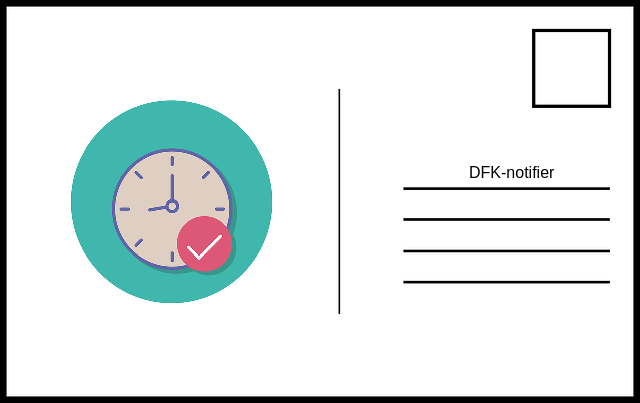

## Defi Kingdoms hero notifications

Get an email when your Defi Kingdoms hero stamina is full, making your hero 100% ready to quest. Don't lose time, having your hero not questing when it should, while you are unaware of the situation. This package will provide you with email notifications for all your heroes!

This package uses ONLY the public 0x address of your wallet.

For easier deployment, I created a dockerized installation, but the package can be used without it.


### Setup

* Fill in configuration file (config.json)
``` text
"sleep_time" -> sample rate of heros stamina state in seconds
"user_address" -> public 0x address of your wallet
"email/server & email/port" -> sender email SMTP server, ip and port, default data is set for outlook
"email/sender_email & email/sender_password" -> sender email credentials, from which emails will be sent. I advice you to create new dummy email for this.
"email/receiver_emails" -> array of emails on which you want to receive notification.
```

* Build docker image
``` bash
docker build -t dfk-notifier:latest -f Dockerfile .
```

* Run docker container
``` bash
docker run -d --rm --name dfk-notifier dfk-notifier:latest
```
